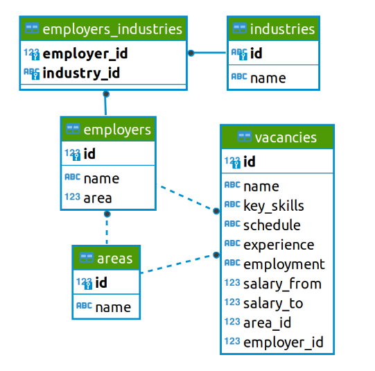
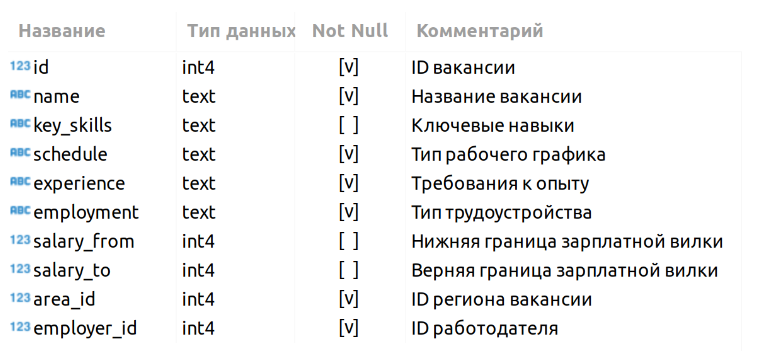
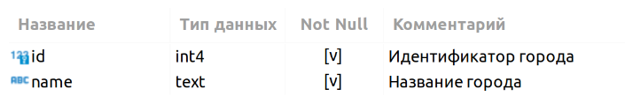
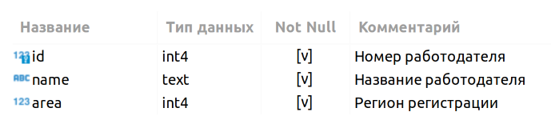
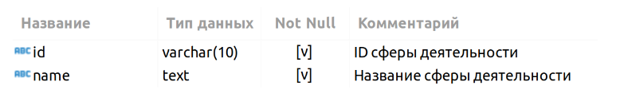
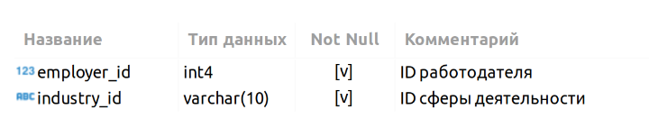

# Проект "Анализ вакансий из HeadHunter"

## Оглавление  
[1. Описание проекта](README.md#Описание-проекта)  
[2. Какой кейс решаем?](README.md#Какой-кейс-решаем?)  
[3. Краткая информация о данных](README.md#Краткая-информация-о-данных)  
[4. Результаты](README.md#Результаты)

### Описание проекта    
Представьте, что вы устроились на работу в кадровое агентство, которое подбирает вакансии для IT-специалистов. Ваш первый проект — создание модели машинного обучения, которая будет рекомендовать вакансии клиентам агентства, претендующим на позицию Data Scientist. 

:arrow_up:[к оглавлению](README.md#Оглавление)

### Какой кейс решаем?    
Необходимо исследовать данные от HeadHunter с помощью SQL запросов к таблицам.

:arrow_up:[к оглавлению](README.md#Оглавление)

### Краткая информация о данных
Мы имеем 5 таблиц:

1. Таблица vacancies (таблица хранит в себе данные по вакансиям и содержит следующие столбцы):

2. Таблица areas (таблица-справочник, которая хранит код города и его название):

3. Таблица employers (таблица-справочник со списком работодателей):

4. Таблица industries (таблица-справочник вариантов сфер деятельности работодателей):

5. Таблица employers_industries (дополнительная таблица, которая существует для организации связи между работодателями и сферами их деятельности):

:arrow_up:[к оглавлению](README.md#Оглавление)

### Результаты  
В результате работы были выполнены SQL запросы, результаты которых помогли проанализировать данные и сделать определенные выводы.

:arrow_up:[к оглавлению](README.md#Оглавление)

Если информация по этому проекту покажется вам интересной или полезной, то я буду очень вам благодарен, если отметите репозиторий и профиль
